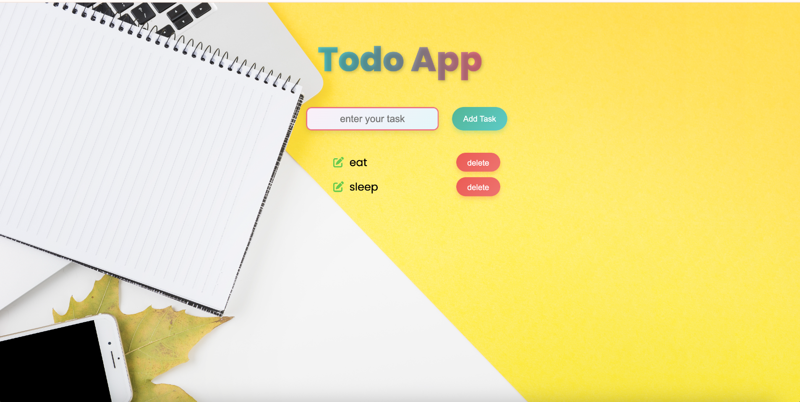

# 📝 Todo App

A clean and responsive **Todo List Application** built with HTML, CSS, and Vanilla JavaScript.  
Easily add, delete, and manage your tasks with a visually appealing gradient-based UI.

---

## 🚀 Features

- ➕ Add new tasks quickly with a single click.
- ❌ Delete tasks individually.
- 🎨 Modern gradient buttons with smooth hover effects.
- 📱 Fully responsive for mobile and desktop.
- ⚡ Lightweight — No frameworks, just pure HTML, CSS, and JavaScript.

---

## 🛠️ Built With

- **HTML5** for structure.
- **CSS3** for design and responsiveness.
- **JavaScript (Vanilla)** for functionality.
- **Font Awesome** for icons.

---

## 📷 Preview



---

## ⚙️ How to Use


1. **Get the Code**
   - Click the green **Code** button on this repository.
   - Select **Download ZIP** and extract it.  
     **OR** clone it via terminal:
     ```bash
     git clone https://github.com/<your-username>/todo-app.git
     ```

2. **Open the Project**
   - Navigate into the folder:
     ```bash
     cd todo-app
     ```
   - Open the `index.html` file in your browser by double-clicking it.  
     *(Optional: Use VS Code Live Server for auto-refresh.)*

3. **Add a Task**
   - Type your task in the input box.
   - Click the **Add Task** button or press **Enter**.

4. **Delete a Task**
   - Click the red **delete** button next to the task you want to remove.

5. **Edit the Code**
   - Open `style.css` to change colors, fonts, or background.
   - Open `app.js` to modify the add/delete functionality.
   - Save your changes and refresh the browser to see updates.

---

💡 *Made with ❤️ using HTML, CSS, and JavaScript.*
